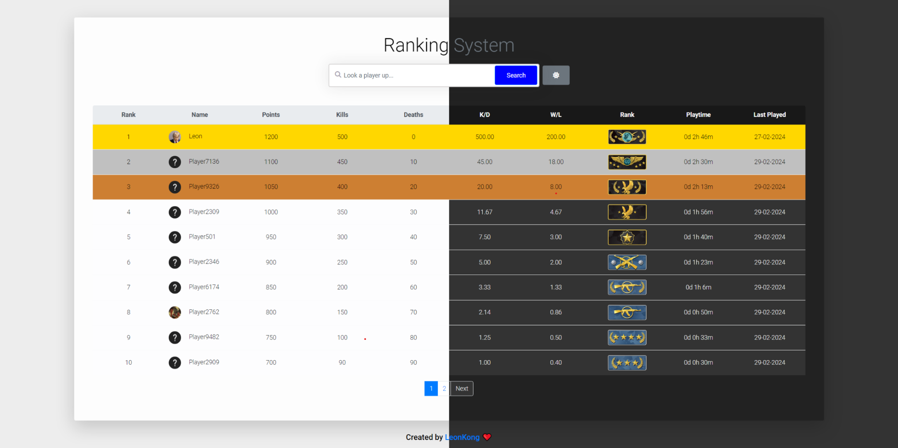

# CS2 RanksPoints Web Panel

## Overview

The CS2 RanksPoints Web Panel is a PHP-based interface designed to work with the CS2 RanksPoints Counter-Strike server plugin. It offers a user-friendly display of player stats such as ranks, playtime, and K/D ratios, making this data easily accessible and visually clear.

## Features

- **Ranking System**: Displays player ranks based on their game performance.
- **Player Statistics**: Shows detailed statistics like playtime, K/D ratio, W/L ratio, etc.
- **Image Representation**: Each rank is represented by a specific image for easy identification.
- **Steam ID Integration**: Converts various Steam ID formats to SteamID64 for standardization.
- **Responsive Design**: The interface is responsive across various devices.
- **GeoIP Feature**: Displays country flags next to player names, enhancing the visual representation with geographical insights. This feature requires the [CS2-GeoIP-RanksPoints Module](https://github.com/ABKAM2023/CS2-GeoIP-RanksPoints).

## Configuration Options

Several options in the `config.php` file allow customization of the web panel's functionality and appearance, including site titles, search and pagination toggles, and Steam API key configuration.

## Dependencies

- **Web Server**: Apache or Nginx.
- **PHP**: Version 7.2 or higher.
- **MySQL Database**: Version 5.6 or higher.
- **CS2 RanksPoints Plugin**: Ensure installation and configuration on your game server.

## Installation

1. **Download and Clone Repository**: Use the provided Git command.
2. **Configure Database Connection**: Edit `inc/config.php` for database and site settings.
3. **Deploy to Web Server**: Upload files and access through a web browser.

## GeoIP Feature Integration

Enables GeoIP functionality for displaying country flags next to player names. Requires the installation of the CS2-GeoIP-RanksPoints module on your server. Configure `enable_geoip` and `enable_flags` in the web panel settings to activate this feature.

## Usage

Players can view their ranks and statistics by visiting the web page.

## Features to Implement

### Completed Features
- [x] Modern Design
- [x] Pagination
- [x] Steam Profile Pictures
- [x] Caching
- [x] Light/Dark Mode
- [x] Bootstrap Integration
- [x] Country Icons (GeoIP)
- [x] Really cool charts

### Pending Features
- [ ] Filters on the Table Head

## Contributing

Contributions are welcome. Fork the repository, make changes, and submit a pull request. For bugs or suggestions, open an issue in the GitHub repository.

## Disclaimer ⚠️⚠️⚠️

This is a learning project and not a professional-grade application. Feedback and contributions are appreciated.

## License

Licensed under GPL-3.0.