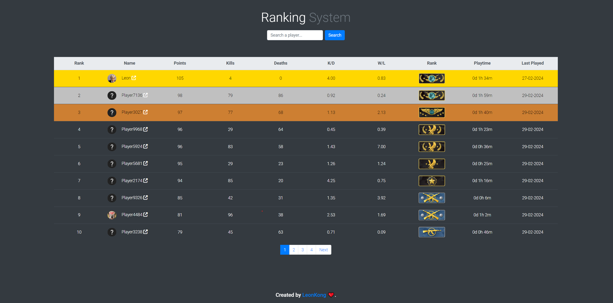

# CS2 RanksPoints Web Panel



## Overview

The CS2 RanksPoints Web Panel is a PHP-based interface I created to work with the CS2 RanksPoints Counter-Strike server plugin. It offers a user-friendly display of player stats such as ranks, playtime, and K/D ratios, making this data easily accessible and visually clear.

## Features

- **Ranking System**: Displays player ranks based on their performance in the game.
- **Player Statistics**: Shows detailed statistics like playtime, K/D ratio, W/L ratio, etc.
- **Image Representation**: Each rank is associated with a specific image for easy identification.
- **Steam ID Integration**: Converts various Steam ID formats to SteamID64 for standardization.
- **Responsive Design**: The interface is designed to be user-friendly and responsive across various devices.

## Dependencies

- **Web Server**: Apache or Nginx recommended.
- **PHP**: Version 7.2 or higher.
- **MySQL Database**: MySQL version 5.6 or higher, or MariaDB.
- **[CS2 RanksPoints Plugin](https://github.com/ABKAM2023/CS2-RanksPoints)**: This web panel is specifically designed to work with the CS2 RanksPoints plugin for Counter-Strike servers. Ensure you have the plugin installed and configured on your game server.

## Installation

1. **Download the Project**:
   - Begin by downloading the project files to your local machine or server. Use the following Git command to clone the repository:
     ```
     git clone https://github.com/Leon7810/RanksPoints-Web.git
     ```

2. **Configure the Database Connection**:
   - Open the `inc/config.php` file in a text editor.
   - Edit the configuration settings within this file to establish a connection to your database and configure the site settings as per your requirements.

3. **Deploy to Web Server**:
   - After configuring the settings, upload the project files to your web server.
   - Navigate to your project's URL in a web browser to access the application.

Certainly! Here's an addition to the README that includes instructions for running the site using Docker and Docker Compose, along with the necessary requirements:

---

## Running with Docker and Docker Compose

The CS2 RanksPoints Web Panel can also be run inside Docker containers using Docker and Docker Compose. This method encapsulates the application in a container, making it easier to manage dependencies and ensuring consistency across different environments.

### Prerequisites

- Docker installed on your machine.
- Docker Compose installed on your machine.

### Dependencies for Docker

- A web server container (such as Apache or Nginx).
- PHP 7.2 or higher.
- MySQL or MariaDB database.
- Required PHP Extensions: `mysqli`, `pdo`, `pdo_mysql`, `bcmath`.

### Dockerfile

Create a `Dockerfile` for PHP with the required extensions. Here's an example Dockerfile:

```Dockerfile
FROM php:7.4-fpm
RUN docker-php-ext-install mysqli pdo pdo_mysql bcmath
```

### Docker Compose

Create a `docker-compose.yml` file to define and run the multi-container Docker application. Here's an example configuration:

```yaml
version: '3'

services:
  web:
    image: nginx:latest # or use apache image
    volumes:
      - ./path/to/your/site:/var/www/html
      - ./path/to/your/nginx.conf:/etc/nginx/nginx.conf:ro
    ports:
      - "80:80"
    depends_on:
      - php

  php:
    build: .
    volumes:
      - ./path/to/your/site:/var/www/html

  db:
    image: mysql:5.7 # or use mariadb
    environment:
      MYSQL_ROOT_PASSWORD: rootpassword
      MYSQL_DATABASE: yourdatabase
      MYSQL_USER: user
      MYSQL_PASSWORD: password
    volumes:
      - db_data:/var/lib/mysql

volumes:
  db_data:
```

### Instructions

1. Place your website files in a directory accessible to Docker.
2. Create a `Dockerfile` for PHP in the same directory as your `docker-compose.yml`.
3. Adjust the `docker-compose.yml` file paths to match your setup.
4. Run `docker-compose up -d` to start the containers.
5. Access the application through the web server's exposed port.

### Notes

- Ensure that your database connection settings in `inc/config.php` are configured to connect to the Docker MySQL/MariaDB service.
- For Nginx, you'll need a `nginx.conf` file properly configured for PHP processing. For Apache, ensure that your `.htaccess` and other configuration files are set up correctly.

---

Feel free to adjust the Docker and Docker Compose configurations to match your specific requirements and environment.

## Usage

After installation, players can view their ranks and statistics by visiting the web page.

## Features to Implement
- [x] Make the design more modern.
- [x] Add pagination to the table.
- [x] Add steam profile pictures.
- [x] Add caching.
- [ ] Add filters on the table head.

## Contributing

Contributions to the CS2 RanksPoints Plugin are welcome. Please feel free to fork the repository, make changes, and submit a pull request. If you find any bugs or have suggestions, please open an issue in the GitHub repository.

## Disclaimer ⚠️⚠️⚠️

This project is a learning endeavor for me and not a professional-grade application. Errors and issues may occur, and any feedback or contributions to improve the project are highly appreciated.

## License

This project is licensed under GPL-3.0 license.
and yes this was written by ai
